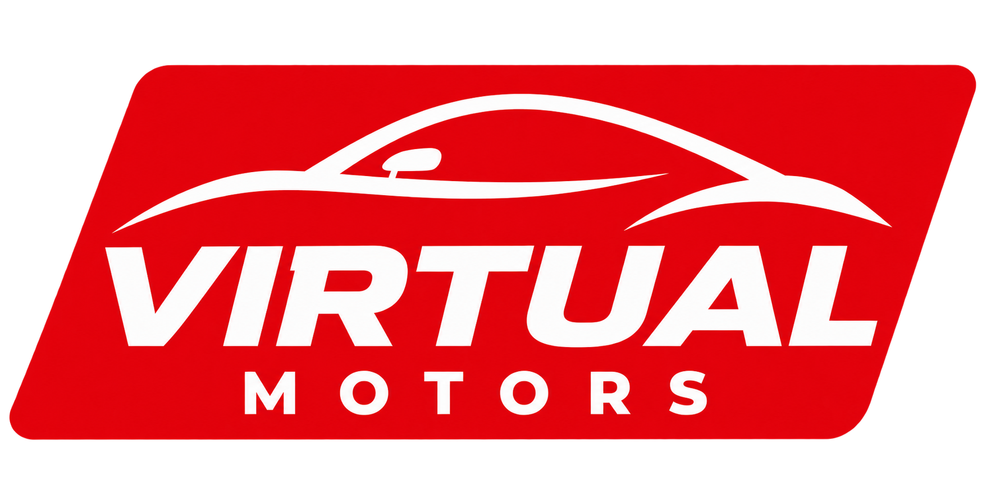

# Virtual Motors

**E-commerce desenvolvido em grupo com metodologia Scrum**

---

## Sobre o projeto

O **Virtual Motors** é uma loja virtual desenvolvida por uma equipe de 5 pessoas, utilizando um fluxo de trabalho baseado em **Scrum**.

O sistema tem como objetivo oferecer uma experiência simples de compra, desde a visualização dos produtos até a finalização do pedido.

---

## Funcionalidades

### Usuários
- Cadastro e validação de usuários
- Verificação de e-mail
- Login e logout
- Controle de acesso
- Perfis de usuário e administrador

### Administração
- Gerenciamento de usuários
- Cadastro, consulta, alteração e exclusão
- Pesquisa e listagem dinâmica
- Gerenciamento de produtos
- Cadastro, consulta, alteração e exclusão
- Pesquisa e visualização de produtos

### Loja
- Catálogo de produtos
- Pesquisa de produtos
- Detalhes e disponibilidade
- Carrinho de compras
- Alteração de quantidade e remoção de itens
- Cálculo de subtotal e total
- Finalização da compra

### Conta e pedidos
- Visualização e alteração dos dados da conta
- Alteração de senha e contato
- Histórico de compras
- Consulta dos detalhes dos pedidos

### API externa
A aplicação deverá integrar uma **API externa relacionada ao funcionamento do sistema**, como:
- Consulta de CEP
- Cálculo de frete
- Cotação de moedas
- Localização

---

## Tecnologias

- **Front-end:** HTML, CSS e JavaScript
- **Back-end:** PHP
- **Banco de dados:** SQL
- **API:** a definir

> A stack poderá ser atualizada conforme as definições técnicas da equipe.

---

## Equipe

| Função | Responsabilidade |
|---|---|
| Scrum Master | Organização e acompanhamento do projeto |
| Analistas | Levantamento de requisitos e validações |
| Developers | Desenvolvimento e implementação |

**Equipe:** 5 integrantes

---

## Status

🚧 **Em desenvolvimento**

Planejamento e definições técnicas em andamento.

---

## Como executar

As instruções de instalação e execução serão adicionadas após a definição da stack e configuração do ambiente.

---

## Licença

Este projeto está sob a licença **MIT**.
